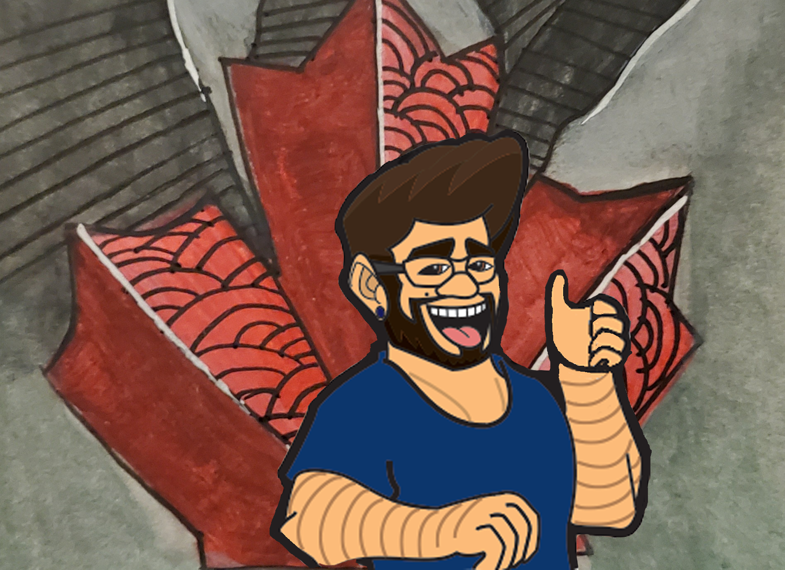

<!DOCTYPE html>
<html>

<head>
    <meta charset="utf-8">
    <Title>Welcome to Grizz's Page</Title>
    <meta name="author" content="Grizz of the Wild">
    <meta name="description" content="Tech-infatuated, Hockey-loving, aspiring coder and creative">
    <meta name="viewport" content="width=device-width, initial-scale=1">
    <link rel="icon" type="image/png" href="grizzfavicon.png">
    <link rel="stylesheet" href="GrizzoftheWild.css">
    <!--[if lt IE 9]>
        
    <![endif]-->

</head>

<body>
    <header id="mainheader">
        <nav>
            
        </nav>
    <h1>Grizz</h1>
    <h2>(Brandon Baldwin)</h2>
    <h3>Tech-infatuated, Hockey-loving, aspiring coder and creative</h3>
    

    

</body>

</html>
